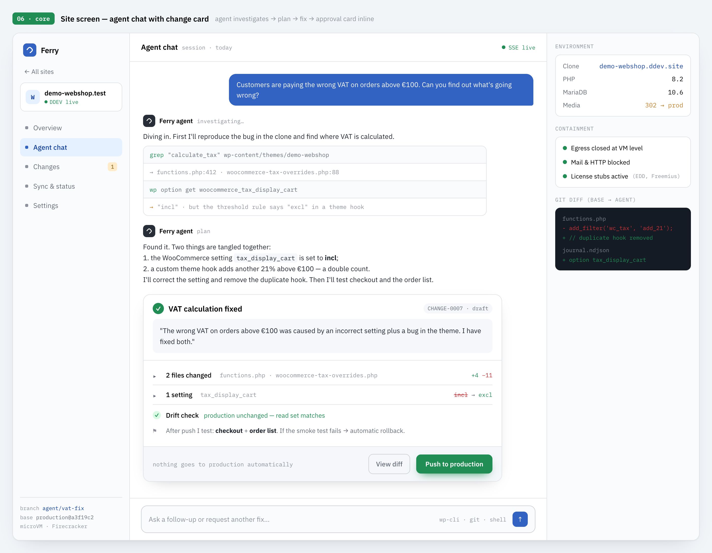
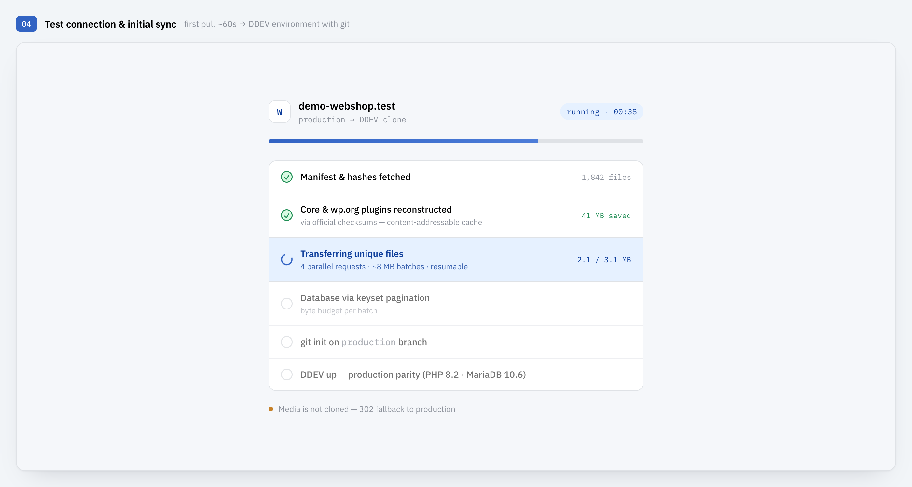
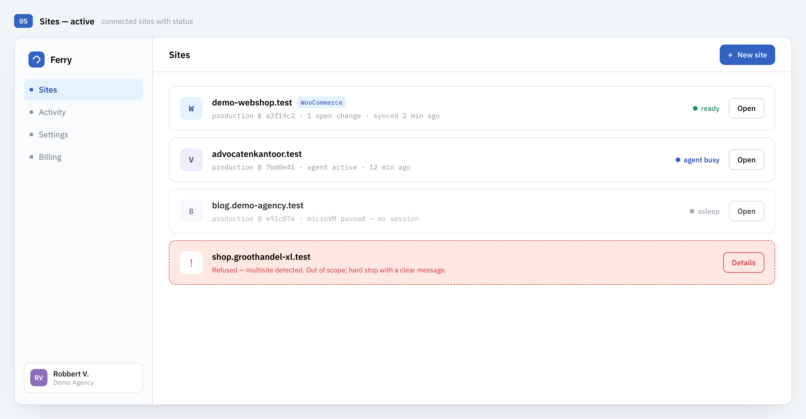
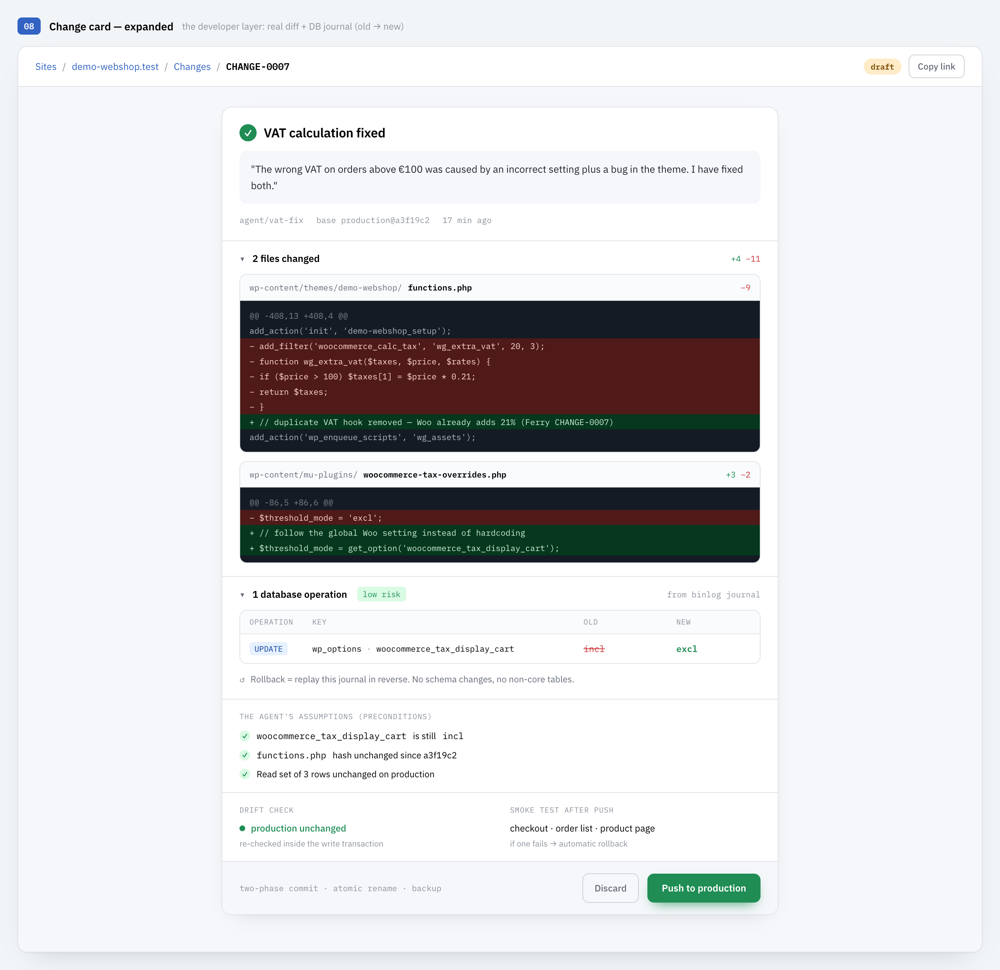
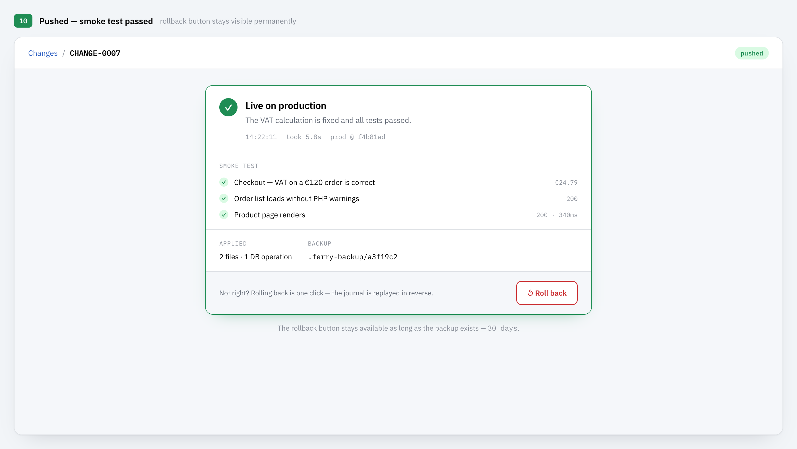
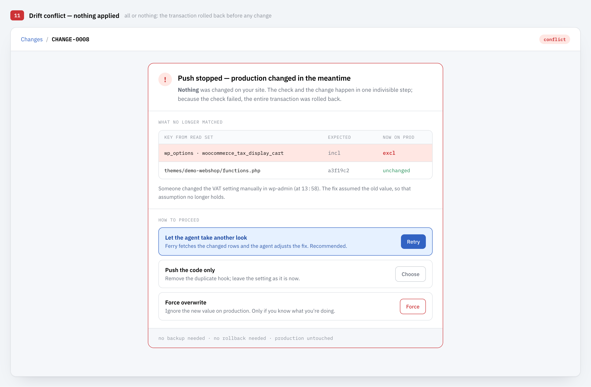

# Ferry

> Give a coding agent full, safe access to any WordPress site — no SSH needed. Clone production in about a minute, investigate and fix at full speed, and push the fix back with drift checks, a smoke test, and one-click rollback.

Ferry starts from a simple observation: **if a coding agent could safely work on every WordPress site, most problems would be solved at least ten times faster.** An agent with a filesystem, git, and wp-cli finds in minutes what takes a human an afternoon of clicking through wp-admin and FTP. The only reasons that doesn't happen today are access and safety — and those are exactly the two problems Ferry solves.

> **Status: open beta, under active development.** The dashboard images in this README are design previews from the product spec — not screenshots of the live product.



## The problem

**Most WordPress sites have no SSH.** They run on shared hosting where FTP and wp-admin are all you get. Without a shell, a coding agent can't grep, can't read files, can't run wp-cli — the very things that make it effective. And even where SSH exists, letting an agent loose on a live site is reckless: one wrong write to the database and the shop is down.

**Staging doesn't really solve it.** You can copy production to a staging site, but WordPress's design works against you. URLs live inside the database — including inside serialized PHP data — so the classic migration approach does a search-replace across every table, which silently corrupts serialized values and makes the copy subtly different from the original. Options tables mix content, configuration, and environment into one pile. PHP and MariaDB versions rarely match production exactly. The result: staging is always *almost* production, and the bug you're hunting often lives precisely in the difference. Worse, staging tools solve the trip *out* — nobody solves the trip *back*: getting a verified change from staging into production, without overwriting what changed there in the meantime.

## What Ferry does

Ferry gives the agent a clone that genuinely behaves like production, and a way back that is safer than editing production by hand:

1. **Pair** — install the Ferry Connect plugin on the production site and pair with a short one-time code (device flow, like `gh auth login`). Works on any host: the plugin talks plain HTTPS through the WP REST API. No SSH, no FTP.
2. **Pull** — Ferry clones the site into an environment with the same PHP and MariaDB/MySQL versions, extensions, limits, and wp-config constants as production. First clone in about a minute; refreshing an existing clone takes seconds.
3. **Agent session** — chat with a Claude-powered agent scoped to the site. It has filesystem, git, and wp-cli access to the clone at local-disk speed — and no access whatsoever to production.
4. **Change card** — every fix becomes a change card: a plain-language summary anyone can judge, with the file diff, database operations, the agent's stated assumptions, and a smoke-test plan underneath for whoever wants to look deeper.
5. **Push** — one human click. Ferry stages the files, verifies hashes, checks that production hasn't drifted, swaps atomically with a backup, replays the database changes in a single transaction, and runs a smoke test. If anything fails: automatic rollback. A rollback button stays available afterwards, so undoing is one click — not a support ticket.

**Nothing goes to production automatically.** The agent proposes; you approve.

## Why the clone is the real site

This is where staging tools fall short, and where Ferry is deliberate:

- **Parity, not approximation.** The plugin reports PHP version, database flavor and version, extensions, server limits, and all user-defined wp-config constants; the clone is built to match. A deprecation fatal that exists on production exists in the clone — and vice versa.
- **No search-replace.** The database is cloned byte-identical. The clone's domain is applied at runtime through WordPress's own option filters, so serialized data is never touched and never corrupted. It also means any database difference you see later is a *real* change, not migration noise.
- **Read-only business data.** Orders, customers, and posts are a snapshot for the agent to read — they never travel back. That an order comes in mid-session is irrelevant, because live data is never overwritten.

## Why it's fast

Speed here isn't brute force — it's not sending what doesn't need to travel:

- **Reconstruct instead of transfer.** Of a typical ~60 MB WordPress install, ~45 MB is core and ~12 MB is wordpress.org plugins — identical on every site in the world. Ferry verifies them against official checksums and rebuilds them from the source, so only the few MB of genuinely unique files cross the wire, in resumable, HMAC-signed batches the plugin serves in parallel within shared-hosting time limits. A useful side effect: any modified or hacked core file is flagged the moment you clone.
- **Refresh in seconds.** After the first clone, Ferry never pulls everything again. A single ~200-byte fingerprint check tells it whether anything changed at all; block fingerprints on the database narrow a refresh down to only the rows that actually differ.
- **Work happens locally.** An agent session is hundreds of small operations — grep, read, edit. Done remotely over HTTP, each one costs hundreds of milliseconds and adds up to minutes of pure waiting. In the clone they cost about a millisecond, so the agent investigates broadly instead of economizing on every step.



## Version control for files *and* database

Every clone is a git repository over the entire WordPress root, core included. Every pull is a commit on the `production` branch; the agent works on its own branch, so the diff between the two is exactly what would go to production — including a patched or hacked core file that other tools would never show you.

The database gets the same treatment. Every change the agent makes — no matter how it's written — is captured and distilled into a journal of typed operations with old and new values, committed alongside the code. Pushing replays the journal on production; rolling back replays it in reverse. Files and database move together, as one versioned, reversible change.

## Safe by construction

- **The plugin can't execute anything.** Ferry Connect runs no commands on production — no `exec()`, no eval, no remote wp-cli. It's a dumb, auditable transport layer: dependency-free PHP with HMAC-signed requests and a small closed set of typed write operations. See the [security review](docs/2026-07-26-ferry-plugin-security-skim.md).
- **Drift detection before every write.** Ferry verifies production still matches what the agent saw: hash checks on exactly the files being overwritten, and a compare-and-swap inside a single database transaction on exactly the rows the fix depends on. If production changed in the meantime, the push stops with a conflict card and nothing is written — all or nothing.
- **Everything is reversible.** The atomic swap keeps a backup; the DB journal replays in reverse; hashes verify the restore.
- **The agent is contained.** The clone is its whole world: network egress closed at the VM level, mail and outbound HTTP blocked, license endpoints answered by local stubs so premium plugins keep working without phoning home. No test email ever reaches a real customer.

## More design previews

| | |
|---|---|
|  |  |
| *Connected sites with status* | *A change card expanded: diff, DB journal, preconditions, smoke-test plan* |
|  |  |
| *After the push: smoke test green, rollback stays available* | *Drift conflict: production changed under the agent — push refused, nothing written* |

## Repository layout

| Directory | What it is |
|---|---|
| `ferry-cli/` | The clone/push engine (`ferry link`, `pull`, `push`, `fetch-uploads`) with pluggable clone substrates (DDEV, Fly) |
| `ferry-server/` | Control plane: Fastify API, SQLite store, agent session runner (Claude Agent SDK), change cards, push manager; serves the dashboard |
| `ferry-dashboard/` | React dashboard: pairing flow, site overview, agent chat, change-card review |
| `ferry-plugin/` | Ferry Connect — the dependency-free PHP plugin installed on the production site |
| `ferry-sited/` | Privileged in-container agent for the Fly site runtime (SQL, binlog, wp-cli, file transfer over the private network) |
| `contracts/` | Cross-language HMAC test vectors shared by the TypeScript signer and PHP verifier |
| `docker/` | Build context for the Fly site-runtime image (WordPress + MariaDB + binlog + ferry-sited) |
| `e2e/` | Shared fixtures for end-to-end runbooks (fake license store, demo licensed plugin) |

## Development

Prerequisites:

- **Node 24.x** — but not 24.19.0, which crashes `better-sqlite3` ([nodejs/node#63642](https://github.com/nodejs/node/issues/63642)); the Docker image pins 24.18.1
- **Docker + DDEV** for local production-parity clones
- An **Anthropic API key** in a root `.env` (`ANTHROPIC_API_KEY=…`) for agent sessions

```bash
npm install

# control plane (API + dashboard host)
npm --workspace ferry-server run dev

# dashboard (Vite dev server)
npm --workspace ferry-dashboard run dev

# CLI
npm --workspace ferry-cli run ferry -- --help

# tests
npm --workspace ferry-cli run test
npm --workspace ferry-server run test
npm --workspace ferry-sited run test
npm --workspace ferry-dashboard run e2e
```

## Documentation

- [`docs/ferry-saas-walking-skeleton-specs.md`](docs/ferry-saas-walking-skeleton-specs.md) — the product spec: proposition, push, drift detection, approval UX
- [`docs/ferry-walking-skeleton.md`](docs/ferry-walking-skeleton.md) — the base design: CLI + plugin architecture, airtight clone, asymmetric write-back (Dutch)
- [`docs/2026-07-26-ferry-plugin-security-skim.md`](docs/2026-07-26-ferry-plugin-security-skim.md) — security review of the Connect plugin
- [`docs/superpowers/specs/`](docs/superpowers/specs/) — per-subsystem design docs (git substrate, fidelity, control plane, agent sessions, write-back, hardening, Fly deployment)

## License

No license has been chosen yet — all rights reserved for now.
